# NETWORKWALKS-B083-WK2-CYBERSECURITY-FOOTPRINTING-SCANNING


This repository documents the completion of my Week 2 project at Networkwalks.


## Week 2 Project — Footprinting & Network Scanning

This project documents my Week 2 cybersecurity internship activities at NetworkWalks, covering authorized web footprinting and local network host discovery.

## Project Objectives

- Perform authorized web reconnaissance using Kali Linux tools.
- Identify domain, DNS, web-server, and technology information.
- Perform local network host discovery using Zenmap/Nmap.
- Identify live hosts and available MAC-address information.
- Document findings and security observations professionally.

## Lab Environment

| Component | Details |
|---|---|
| OS | Kali Linux 2026.2 |
| Web Reconnaissance Target | `networkwalks.com` |
| Local Network | `172.20.10.0/28` |
| Network Scanner | Zenmap / Nmap |

## Tools Used

- WHOIS
- WhatWeb
- NSLookup
- cURL
- WAFW00F
- DNSRecon
- Zenmap / Nmap

## Modules Completed

| Module | Description | Status |
|---|---|---|
| W2-PM1 | Footprinting with Multiple Kali Tools | ✅ Completed |
| W2-PM5 | Zenmap-Based Network Scanning | ✅ Completed |
| W2-PM-FINAL | Detailed Penetration Testing Report | ✅ Completed |

### Project Goal
Perform authorized footprinting and network scanning activities as part of the Cybersecurity & Ethical Hacking internship program.


### Activities Performed

#### 1. Footprinting (W2-PM1)
- WHOIS lookup for domain registration details
- WhatWeb technology fingerprinting
- DNS resolution with nslookup
- HTTP header inspection with curl
- Web Application Firewall detection with wafw00f
- Full DNS enumeration with dnsrecon

#### 2. Network Scanning (W2-PM5)
- Identified local network configuration
- Performed Ping Scan using Zenmap
- Discovered live hosts and MAC addresses

### Key Findings Summary

- Domain hosted on HostGator with GoDaddy registrar
- Web technologies: WordPress 7.1, WP Download Manager 3.3.58
- Server IP: 192.232.216.135
- Protected by ModSecurity WAF
- Local network scan discovered 2 live hosts

  
## 🔎 Task 1 — WHOIS Domain Reconnaissance

### Scan Command

```bash
whois networkwalks.com
```

## Purpose

WHOIS was used to retrieve publicly available domain registration information.

## Key Findings

- Registrar: GoDaddy.com, LLC
- Domain creation date: 2019-11-06
- Registry expiration date: 2027-11-06
- Name servers: ns6135.hostgator.com and ns6136.hostgator.com
- DNSSEC: Unsigned
- Registrant information: Privacy protected

### Evidence

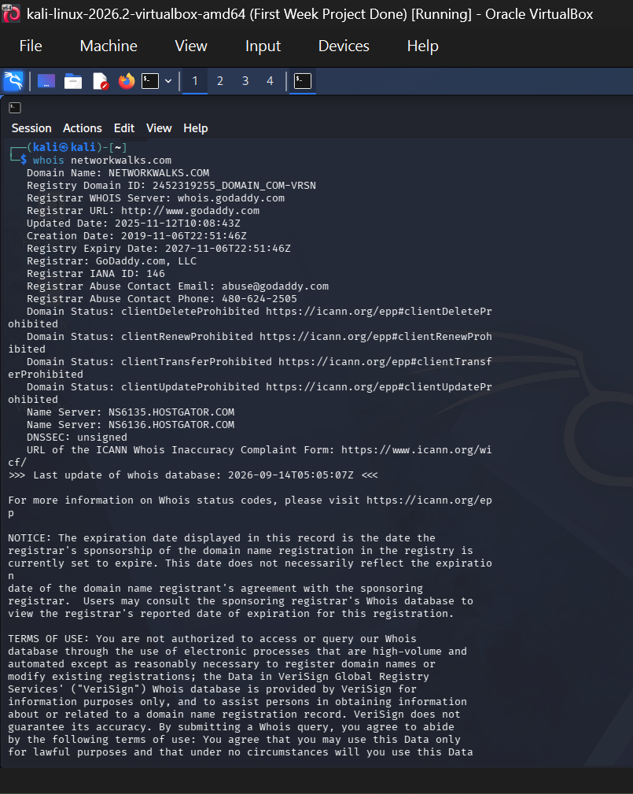
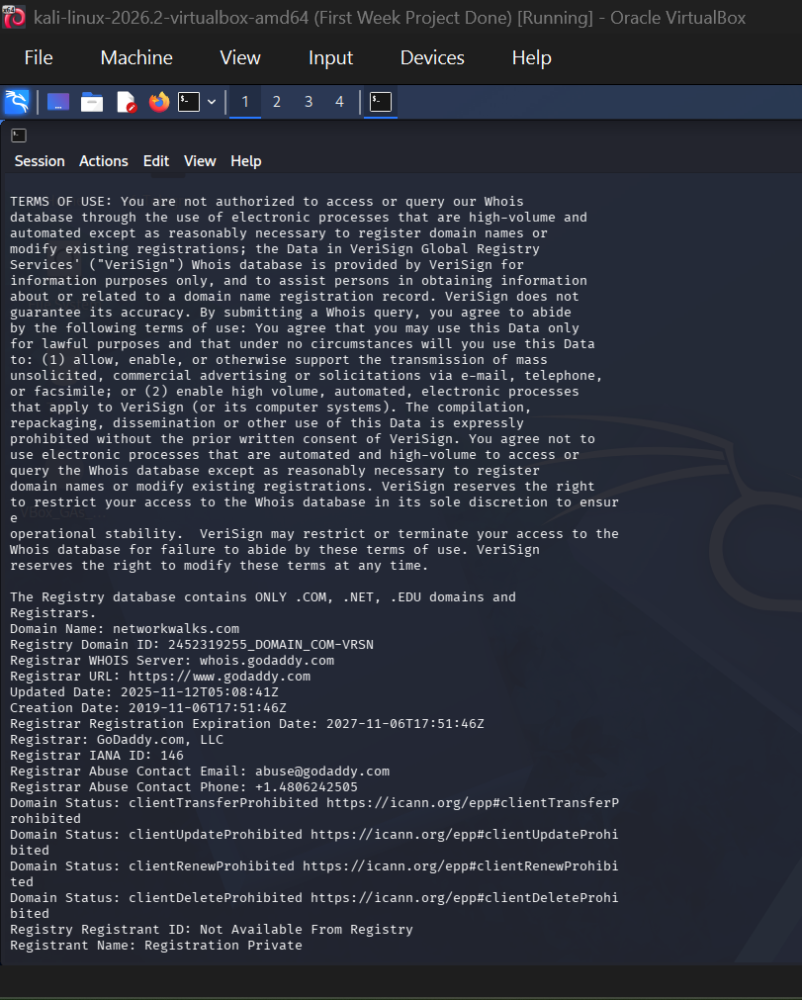
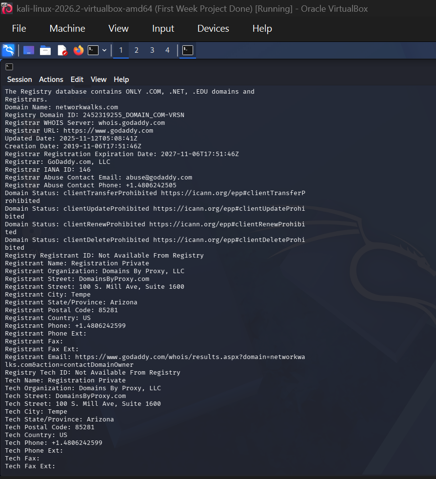

## Task 2 — Web Technology Fingerprinting with WhatWeb

### Scan Command

```bash
whatweb networkwalks.com
```

## Purpose

WhatWeb was used to identify the web technologies, frameworks, content-management systems, web server, and other technologies associated with the target website.

## Key Findings

The scan identified the following technologies and information:

- Web Server: Apache
- Content Management System: WordPress 7.1
- WordPress Download Manager: 3.3.58
- Bootstrap: 7.1
- jQuery: 3.7.1
- Google Tag Manager: Detected
- HTML5: Detected
- HTTP to HTTPS redirection: Observed
- Website Title: Networkwalks Academy
- IP Address: 192.232.216.135
- Email: info@networkwalks.com
- Security-related HTTP headers: Detected

## Analysis

WhatWeb provided useful information about the technologies making up the web application.

This type of fingerprinting can help security professionals understand the potential technology attack surface before conducting further authorized security testing.

The identified technologies should not automatically be considered vulnerabilities. Additional authorized testing would be required to determine whether any specific technology or version contains a security weakness.

### Evidence

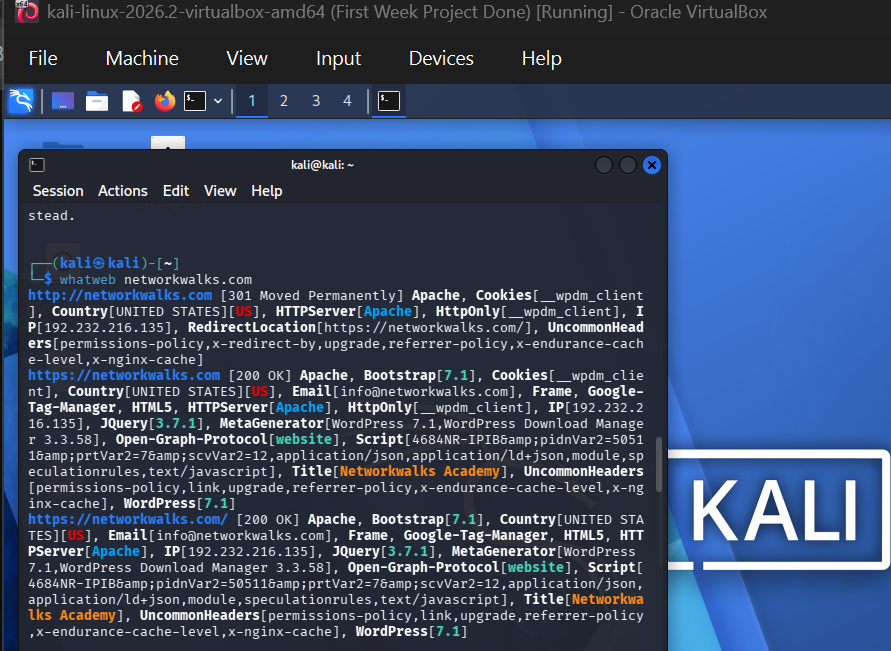


## Task 3 — DNS Resolution with NSLookup

### Scan Command

```bash
nslookup networkwalks.com
```

## Purpose

NSLookup was used to resolve the target domain name to its corresponding IP address through DNS.

## Result

The domain resolved to:

192.232.216.135

The DNS server used for the query was:

8.8.8.8

## Analysis

The result confirms that networkwalks.com resolves to the identified IPv4 address.

DNS resolution is an important part of reconnaissance because it establishes the IP address associated with a domain before further network-level analysis.

### Evidence

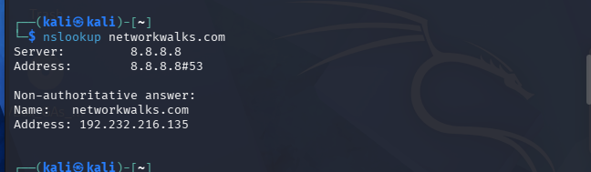

## Task 4 — HTTP Header Analysis with cURL

### Scan Command

```bash
curl -I https://networkwalks.com
```

## Purpose

cURL was used with the -I option to retrieve the HTTP response headers returned by the web server without downloading the complete webpage.

## Key Findings

The server returned:

HTTP/2 200

Other notable headers included:

server: Apache
content-type: text/html; charset=UTF-8
referrer-policy: no-referrer-when-downgrade
x-endurance-cache-level: 0
x-nginx-cache: WordPress

The response also exposed links associated with the WordPress REST API, including:

/wp-json/

## Analysis

The HTTP headers provided information about the server and underlying web technologies.

The HTTP/2 200 response indicates that the request was successfully processed.

The presence of WordPress-related API information further confirms the use of WordPress.

The headers also provide information that can assist with technology identification during reconnaissance.

Note: The Set-Cookie value returned by the server is not included in this documentation because session/cookie values should not be unnecessarily published in a public GitHub repository.

### Evidence

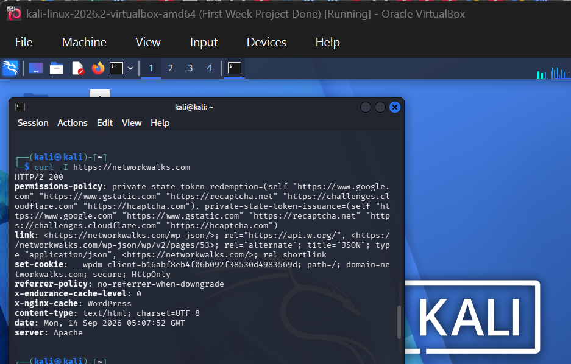


## Task 5 — Web Application Firewall Detection with WAFW00F

### Scan Command

```bash
wafw00f https://networkwalks.com
```

## Purpose

WAFW00F was used to determine whether a Web Application Firewall (WAF) was protecting the target web application and, where possible, identify the WAF technology.

## Result
WAFW00F identified:

ModSecurity (SpiderLabs) WAF

The tool reported:

The site is behind ModSecurity (SpiderLabs) WAF.

## Analysis

The result indicates that a Web Application Firewall is present in front of the web application.

A WAF can provide an additional defensive layer by inspecting and filtering HTTP requests that match known malicious patterns.

However, the presence of a WAF does not mean that the application is completely secure. Application-level vulnerabilities can still exist, and security controls should be assessed as part of a broader security strategy.

### Evidence

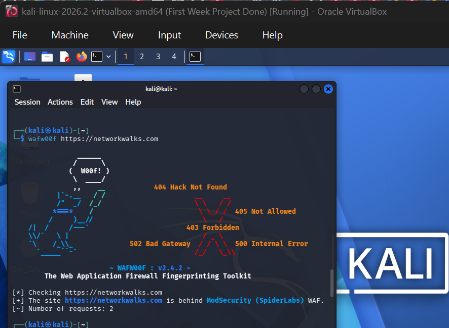

## Task 6 — DNS Enumeration with DNSRecon

### Scan Command

```bash
dnsrecon -d networkwalks.com
```

## Purpose

DNSRecon was used to enumerate publicly available DNS records associated with the target domain.

## Key Findings

The enumeration identified several DNS record types.

SOA Record
SOA ns6135.hostgator.com
Name Server Records
ns6135.hostgator.com
ns6136.hostgator.com
A Record
networkwalks.com → 192.232.216.135
MX Record
mail.networkwalks.com → 192.232.216.135
TXT Records

An SPF record was identified:

v=spf1 +a +mx +ip4:50.87.144.87 +include:websitewelcome.com ~all

A Google site-verification TXT record was also identified.

The verification token itself is intentionally omitted from the public documentation.

SRV Record

DNSRecon identified an email autodiscovery service:

_autodiscover._tcp.networkwalks.com
DNSSEC Observation

DNSRecon reported:

ERROR No answer for DNSSEC query for networkwalks.com

This is consistent with the WHOIS result, which reported:

DNSSEC: unsigned
DNS Server Information Disclosure

DNSRecon also reported an apparent BIND version associated with the authoritative name servers:

BIND 9.16.23-RH

## Analysis

DNSRecon provided a broader view of the domain's DNS infrastructure, including authoritative name servers, mail infrastructure, IP address information, TXT records, and service discovery records.

The apparent BIND version disclosure is useful reconnaissance information because exposed software-version information can assist further vulnerability research. However, version disclosure alone does not establish that the DNS server is vulnerable.

### Evidence

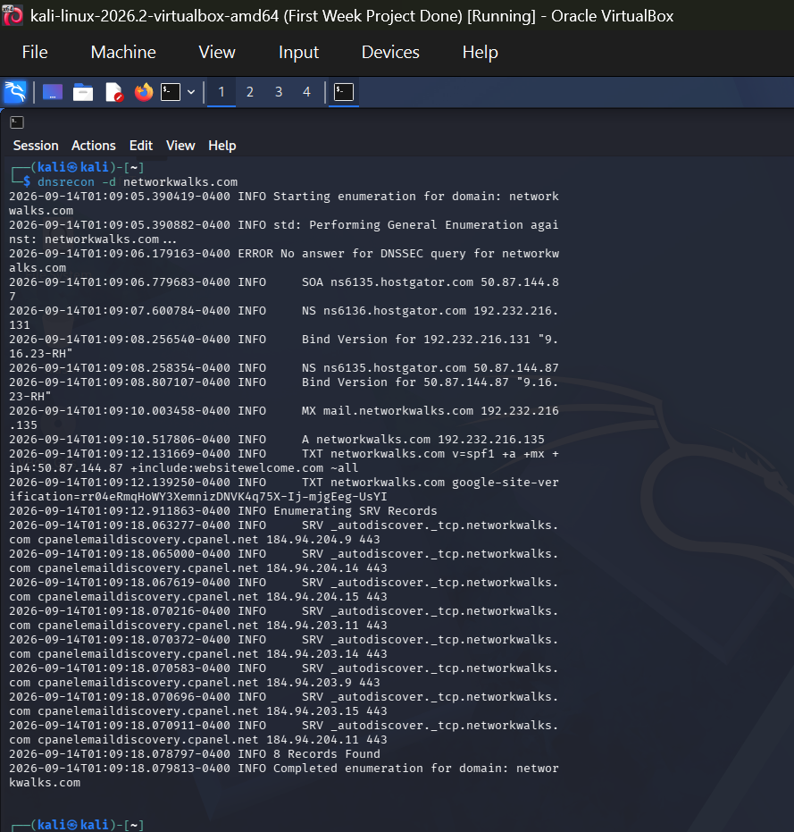


## 📊 W2-PM1 — Findings Summary

| Task | Tool     | Purpose                            | Key Finding                                                      |
| ---- | -------- | ---------------------------------- | ---------------------------------------------------------------- |
| 1    | WHOIS    | Domain registration reconnaissance | GoDaddy registrar, HostGator name servers, DNSSEC unsigned       |
| 2    | WhatWeb  | Web technology fingerprinting      | Apache, WordPress, WordPress Download Manager, jQuery, Bootstrap |
| 3    | NSLookup | DNS resolution                     | `networkwalks.com → 192.232.216.135`                             |
| 4    | cURL     | HTTP header analysis               | Apache, HTTP/2, WordPress-related information                    |
| 5    | WAFW00F  | WAF detection                      | ModSecurity (SpiderLabs) detected                                |
| 6    | DNSRecon | DNS enumeration                    | SOA, NS, A, MX, TXT and SRV records                              |


## 🧠 Key Learning Outcomes

Through this exercise, I gained practical experience using multiple Kali Linux reconnaissance tools to collect and analyze publicly available information about a web domain.

The exercise reinforced the importance of performing reconnaissance systematically before conducting further security testing.

Key areas covered included:

- Domain registration reconnaissance
- Web technology fingerprinting
- DNS resolution
- HTTP header analysis
- Web Application Firewall identification
- DNS record enumeration
- Identification of publicly exposed infrastructure information
- Responsible handling of potentially sensitive reconnaissance data


## 🔐 Security & Ethical Considerations

All reconnaissance activities documented in this project were performed as part of the authorized NetworkWalks cybersecurity training exercise.

The information collected was used strictly for educational and security-learning purposes.

Reconnaissance and security testing should only be performed against systems where explicit authorization has been provided.


# 🔎 W2-PM5 — Zenmap Network Scanning

## Task 1 — Zenmap Installation

Zenmap was downloaded and installed on the Windows host system from the official Nmap/Zenmap distribution.

Zenmap provides a graphical interface for performing Nmap-based network scanning and visualizing discovered network hosts.

### Evidence

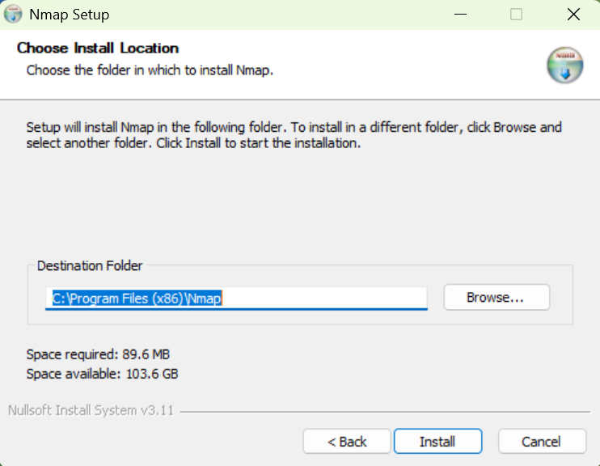


## Task 2 — Local IP Address and LAN Subnet

The local network configuration was checked to determine the IP address of the system and the associated LAN subnet.

The network used for the scan was:

```text
LAN Subnet: 172.20.10.0/28
```
A `/28` subnet contains 16 total IP addresses, including network and broadcast addresses.

### Evidence

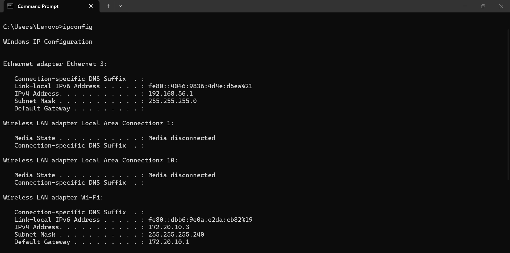

## Task 3 — Discover Live Hosts

A Zenmap Ping Scan was performed against the local subnet to identify hosts that were actively responding.

### Scan Command

```bash
nmap -sn 172.20.10.0/28
```

The -sn option performs host discovery without performing a port scan.

## Scan Result

```text
Starting Nmap 7.991 at 2026-09-14 07:05 +0100

Nmap scan report for 172.20.10.1
Host is up (0.0057s latency).
MAC Address: 66:6D:2F:DC:B6:64 (Unknown)

Nmap scan report for 172.20.10.3
Host is up.

Nmap done: 16 IP addresses (2 hosts up) scanned in 2.64 seconds
```

### Evidence

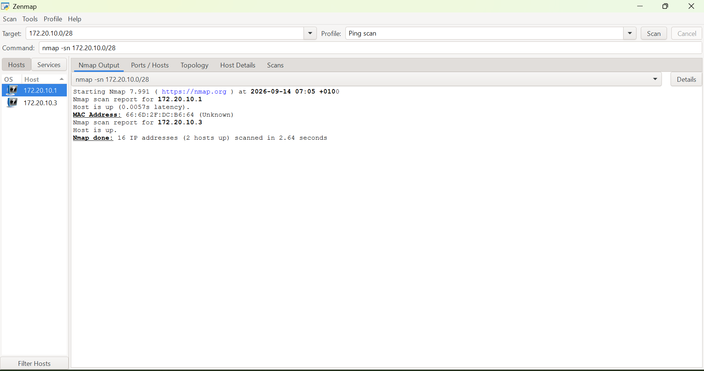

## Task 4 — Number of Live Hosts

The scan covered 16 IP addresses and identified:

```text
2 live hosts

Therefore:

Total IP addresses scanned: 16
Live hosts discovered: 2
```

## Task 5 — IP Addresses of Live Hosts

The following IP addresses responded during the host-discovery scan:

| IP Address    | Status |
| ------------- | ------ |
| `172.20.10.1` | 🟢 Up  |
| `172.20.10.3` | 🟢 Up  |

## Task 6 — MAC Addresses of Live Hosts

Nmap displayed a MAC address for 172.20.10.1.

| IP Address    | MAC Address         | Vendor         |
| ------------- | ------------------- | -------------- |
| `172.20.10.1` | `66:6D:2F:DC:B6:64` | Unknown        |
| `172.20.10.3` | Not displayed       | Not determined |

The Unknown vendor designation does not indicate a security issue. It means Nmap could not associate the detected MAC address with a known vendor in its database.

No MAC address was displayed for 172.20.10.3 in the captured scan output, so no MAC address has been assumed or fabricated.

## Host Discovery Analysis

The Zenmap host-discovery scan successfully identified two active hosts within the scanned /28 subnet.

The host at 172.20.10.1 responded with approximately 5.7 ms latency and exposed the MAC address 66:6D:2F:DC:B6:64.

The second active host, 172.20.10.3, responded to the host-discovery scan, but its MAC address was not displayed in the captured output.

This scan was limited to host discovery. Therefore, the results do not establish which ports, services, operating systems, or vulnerabilities may be present on the discovered hosts.

## Task 7 — Network Topology

Zenmap's Topology view was used to visualize the discovered hosts within the scanned network.

The resulting topology was saved in PDF format for project documentation.


### Evidence

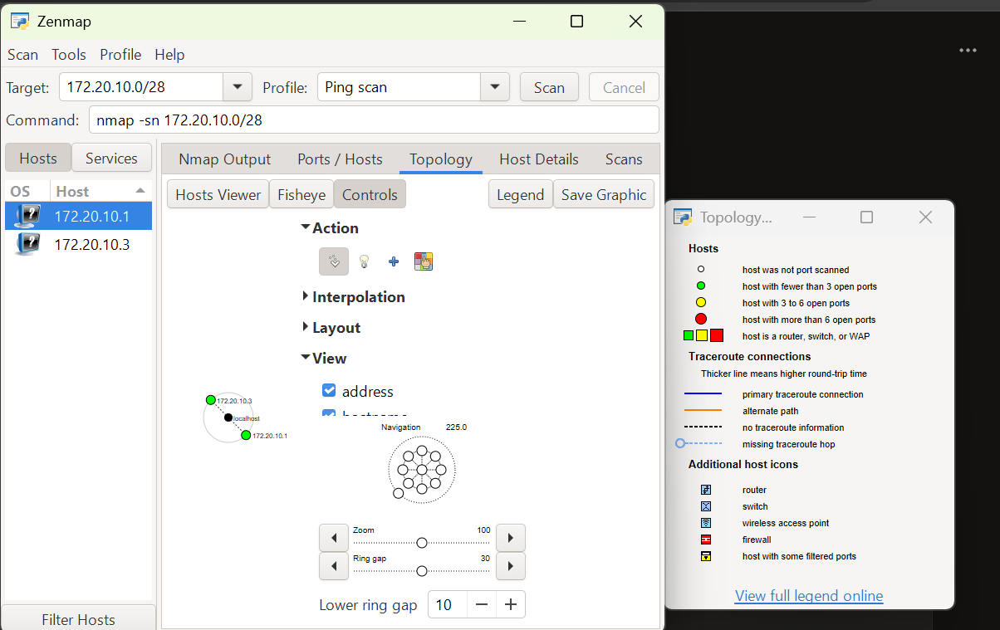

The topology output was also exported and saved as:

`W2-PM5-Network-Topology.pdf`

## W2-PM5 Findings Summary

| Task | Activity                           | Result                                                             |
| ---- | ---------------------------------- | ------------------------------------------------------------------ |
| 1    | Zenmap installation                | Completed                                                          |
| 2    | Local IP and subnet identification | `172.20.10.0/28`                                                   |
| 3    | Live host discovery                | 2 hosts discovered                                                 |
| 4    | Number of live hosts               | 2                                                                  |
| 5    | Live host IP addresses             | `172.20.10.1`, `172.20.10.3`                                       |
| 6    | MAC address identification         | MAC identified for `172.20.10.1`; none displayed for `172.20.10.3` |
| 7    | Network topology                   | Displayed and saved as PDF                                         |

## Key Learning Outcomes

Through this exercise, I gained practical experience using Zenmap/Nmap to:

- Identify a local IP address and subnet
- Perform host discovery using a Ping Scan
- Determine the number of active hosts within a subnet
- Identify the IP addresses of responding hosts
- Examine MAC address information
- Interpret Nmap host-discovery results
- Visualize discovered hosts using Zenmap's Topology feature
- Document and save network-scanning results

## Security & Ethical Considerations

The network scanning activity was performed within the authorized NetworkWalks cybersecurity training environment.

The scan was limited to the designated training network and was conducted for educational and security-learning purposes.

Network scanning should only be performed against systems and networks where explicit authorization has been provided.


## 📄 W2-PM-FINAL — Detailed Penetration Testing Report

The complete Week 2 penetration testing report is available below:

📄 **[View W2-PM-FINAL Report](W2-PM-FINAL/W2-PM-FINAL-Oluwatobiloba-Banjo-NetworkWalks.docx)**


## 👤 Author

**Banjo Oluwatobiloba Adekunle**

Aspiring Cybersecurity Analyst | Network Security Enthusiast  
ISC² Certified in Cybersecurity (CC)  
CompTIA Security+

🔗 **LinkedIn:** https://www.linkedin.com/in/oluwatobiloba-banjo-b2368819b/

💻 **GitHub:** https://github.com/oluwatobilobacybers

## 📌 Project Information

This project is part of my practical cybersecurity internship at NetworkWalks.

**Week:** 02  
**Project:** Footprinting & Network Scanning with Kali Linux  
**Repository:** GitHub

The project focuses on building practical cybersecurity skills through footprinting & network scanning with Kali Linux.
